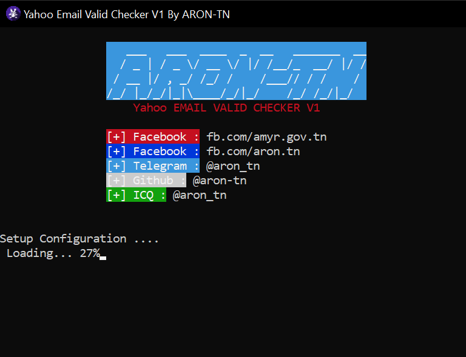
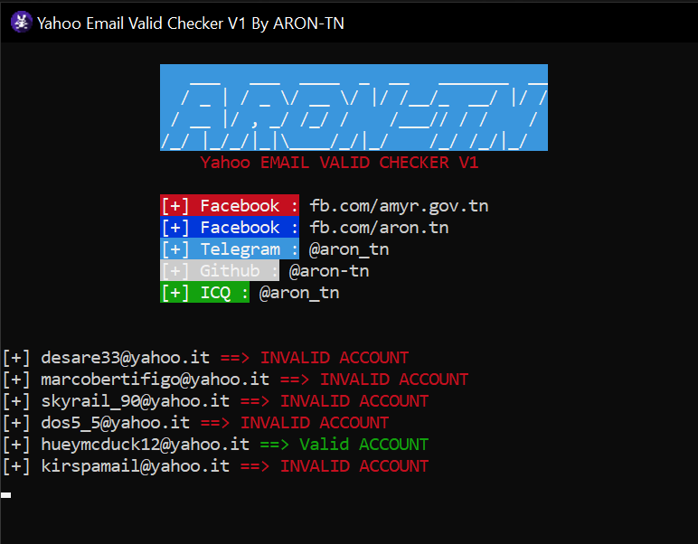

# Yahoo Email Valid Checker V2 With Proxies
<p align="center">
  
</p>

*Useful?*
----
```
Yes .. You can see : 
* Valid Emails
* InValid Emails
```
*using*
----
**Windows**
```
Python Required Version : https://www.python.org/downloads/release/python-391/
Click on "Yahoo Email Valid Checker v1.exe"
```

*Screenshots*
----

<p float="left">
  
   
</p>


*Contact*
----
```
[+] Facebook Page : fb.com/aron.tn
[+] Telegram : @aron_tn
[+] Telegram Channel : https://t.me/Aron_Tn_Store_Official
[+] Email : aron.tn.official@gmail.com
```

<br>©2021 Aron-Tn
